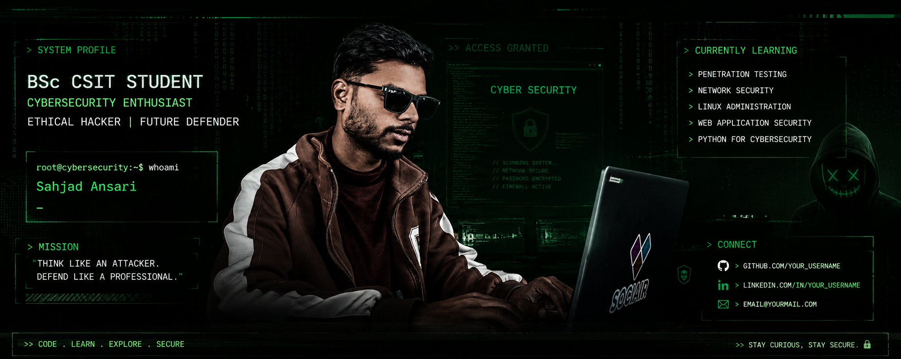

# <div align="center">



# 👨‍💻 Sahjad Ansari

### 🔐 Cybersecurity Enthusiast | BSc CSIT Student | Future Security Analyst

<p align="center">
  
</p>

</div>

---

## 🚀 About Me

```bash
root@cybersecurity:~$ whoami

Name      : Sahjad Ansari
Education : BSc CSIT
Interest  : Cyber Security
Location  : Nepal
Status    : Learning Every Day
```

* 🔐 Passionate about Cyber Security
* 🐧 Linux Enthusiast
* 💻 Learning Python & Networking
* 📚 Exploring Ethical Hacking
* 🎯 Goal: Become a Cyber Security Professional

---

## 🛠️ Tech Stack

```text
Programming : Python, C, C++
Database    : MySQL
Operating   : Linux, Windows
Security    : Networking, Ethical Hacking
Tools       : Git, GitHub, VS Code
```

---

## 📖 Currently Learning

* Web Application Security
* Linux Administration
* Network Security
* Python for Cybersecurity
* Penetration Testing
* Database Security

---

## 📊 GitHub Stats


---

## 🎯 Mission

```bash
Think Like An Attacker.
Defend Like A Professional.
```

---

## ☕ Fun Fact

```bash
while(alive){
    learn();
    practice();
    improve();
}
```

---

## 📫 Connect With Me

* GitHub: https://github.com/ansarisahjad9980-source


---

<p align="center">
  
</p>

<p align="center">
⚡ Stay Curious • Stay Secure ⚡
</p>
